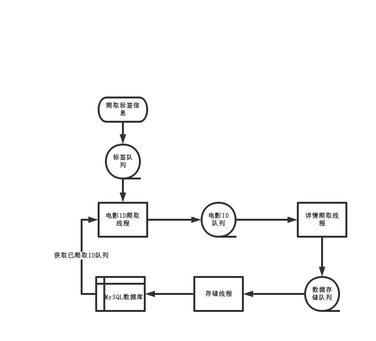

# 豆瓣电影爬虫

## 使用
- 创建s数据库
    - `db.sql` 
- 安装依赖
    - `pip install -r requirements.txt` 或 `pipenv install`
- 执行脚本
    - `python main.py`

## 思路
- 调用接口获取全部标签信息，加入标签队列
- 通过标签队列取出一个标签，爬取该标签下全部电影ID、标题等信息加入电影ID队列
- 电影ID队列取出电影ID，详情页抓取详情，加入存储队列
- 存储队列取出电影详情，存入MySQL

三个线程并发执行任务提高采集效率

## 程序结构图

## 涉及技术点
- requests 请求
- BeautifulSoup 使用 lxml 解析, 解析速度更快，容错率更高
- 使用 CSS 选择器 选择数据，方便易用
- 采用 多线程 并发爬取，加快爬取速度
- 采用 多队列 传递信息，提高并发执行效率
- 使用 random 处理缺失数据
- 启动前检查已爬取电影，可断点续传

## 反爬策略
- 采用 fake_useragent 随机生成 UA
- 爬取时休眠 6~8 秒防止请求过快